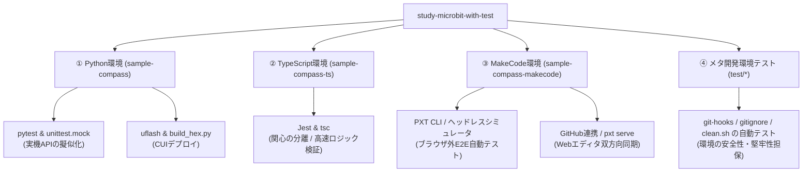

# micro:bit プログラミング環境教材 評価・レビュー報告書

> [!WARNING]
> これは過去のレビュー資料です。現在の教材導線と検証方法は [`docs/README.md`](./README.md) を参照してください。

本プロジェクト（[`study-microbit-with-test`](../)）を、単に micro:bit のコードを書くためだけの教材ではなく、**「組み込み開発とモダンなソフトウェアエンジニアリング（TDD、環境分離、自動テスト、CI/CD）を体験するための『環境教材』」**という観点から総合的にレビューします。

一般的な教育現場における「ブラウザ上でブロックを組んで終わり」という初級学習から一歩進み、**プロの現場で通用する DevOps ワークフローを micro:bit を題材に学べる比類なき環境**として評価します。

---

## 1. 全体像とアーキテクチャ

本プロジェクトは、1つの「方位磁石（コンパス）アプリケーション」を題材に、3つの異なるプログラミング環境（言語・ツールチェーン）と、それらを統制するメタ・テスト環境で構成されています。

---

## 2. 3つのプログラミング環境の教材価値

### ① Python 環境 ([`sample-compass`](../sample-compass/))
* **テクノロジースタック**: Python 3.12 (uv), `pytest`, `unittest.mock`, `uflash`
* **環境教材としての価値**:
  * **実機開発ワークフローの王道**: Web ブラウザを介さず、ローカルの CLI ターミナルから `uflash` 経由で直接 HEX ファイルを書き込む「ファームウェア開発」の基本的なフローを体験できます。
  * **Static Python (MakeCode Python) への配慮**: 標準の MicroPython 用コード（`compass.py`）だけでなく、MakeCode の Python モード向けStatic Pythonコード（[`compass_makecode.py`](../sample-compass/compass_makecode.py)）が用意されています。
  * **モック化によるテスト**: `conftest.py` を使って `sys.modules['microbit']` に `MagicMock` を差し込むことで、PC単体でロジックを検査できます。

### ② TypeScript 環境 ([`sample-compass-ts`](../sample-compass-ts/))
* **テクノロジースタック**: Node.js, TypeScript (`tsc`), `Jest`
* **環境教材としての価値**:
  * **「関心の分離」のベストプラクティス**: micro:bit のハードウェアライブラリ（PXT/MakeCode）に依存しないピュアな TypeScript クラス（[`compass.ts`](../sample-compass-ts/src/compass.ts)）としてロジックを切り離しています。
  * **型安全と堅牢なエラーハンドリング**: Union Type (`'N' | 'NE' | ...`) による方向の定義や、未キャリブレーション時に例外エラー（`Error`）をスローする厳密な検証ロジックを実装。Jest による単体テストの実行速度が圧倒的に速く（10,000回ループも1秒未満）、バグを早期発見する「型安全プログラミング」の重要性を身をもって理解できます。

### ③ MakeCode / PXT 環境 ([`sample-compass-makecode`](../sample-compass-makecode/))
* **テクノロジースタック**: Microsoft PXT CLI, Playwright
* **環境教材としての価値**:
  * **ヘッドレス・シミュレータテスト自動化**: MakeCodeのPXTシミュレーターを起動し、アサーションログを検査するスクリプト（[`simulator-test-runner.cjs`](../sample-compass-makecode/simulator-test-runner.cjs)）が組み込まれています。
  * **Webエディタとの双方向連携**:
    * GitHub リポジトリから Web にインポートする「GitHub 連携」
    * ローカルの `binary.hex` をドラッグ＆ドロップしてブロックを復元する「HEX インポート」
    * VS Code での保存を即時ブラウザに反映する「`pxt serve`（ローカル連携サーバー）」
    これらがドキュメント化されており、ローカルの快適なコーディングと Web のビジュアルブロックの良さを組み合わせた開発環境を学べます。

---

## 3. 【特筆】メタ開発環境テスト (Meta-Testing)

本プロジェクトが他教育用リポジトリと一線を画しているのが、ルート直下の [`test/`](../test/) ディレクトリに配された**「開発環境設定そのものをテストする」**テスト群です。

| テストファイル | テスト内容 | 教材・運用上の価値 |
| :--- | :--- | :--- |
| [`gitignore.test.js`](../test/gitignore.test.js) | 一時リポジトリを作成し `.gitignore` が必要な設定を保持するか検証する | リポジトリ管理をテストで保証する |
| [`build-config.test.js`](../test/build-config.test.js) | 各package.json、CI、READMEの整合性を検証する | 文書と設定の陳腐化を検出する |
| [`clean-script.test.js`](../test/clean-script.test.js) | クリーンアップスクリプト（[`clean.sh`](../scripts/clean.sh)）が追跡中ファイルやlockfileを消さないか検証する | 破壊的操作を安全にする |

> [!IMPORTANT]
> **メタ環境テストの教育的意義**
> 「環境設定が壊れていないか」「README とコードが乖離していないか」をテストで検証する姿勢は、エンタープライズ開発における Infrastructure as Code (IaC) やドキュメンテーション管理 (Docs as Code) の本質です。これを学生が体験できる教材は極めて稀有です。

---

## 4. 教育環境としてのメリット（強み）

1. **実機とシミュレータの「ギャップ」への対峙**:
   組み込み開発で最も困る「実機特有の挙動（キャリブレーション待ちでの停止や、センサーの `undefined`/負の値エラーなど）」に対し、`skipHardware` フラグや例外処理、フォールバック値（前回の値を返す）などの設計を直接コードで体験できます。
2. **DevOps / CI/CD パイプラインの学習**:
   Husky による Git コミット・プッシュフック、GitHub Actions による Python/TypeScript/MakeCode 全体のテストとセキュリティ監査（Bandit、Trivyなど）の自動実行が統合されています。「テストがすべてパスして初めて実機へデプロイできる」という現代のソフトウェア開発の規律を自然と学べます。
3. **ローカルと Web のシームレスな同期**:
   MakeCode のブロックエディタで確認しつつ、ローカルでテストを回すというハイブリッドな同期ワークフローが確立されており、学習者が段階的にテキストプログラミングへ移行するハードルを下げています。

---

## 5. 導入・指導における課題と改善案

### ① 動作要件・前提知識の高さ（中上級者向け）
* **課題**: Node.js、Python（uv）、pytest、Jest、Git、GitHub Actions などのツールチェインを理解・構築する必要があり、初心者が一人で環境構築を行うには難易度が高いです。
* **対策**: 指導者が環境構築手順をまとめたスクリプトや Docker コンテナを用意するか、GitHub Codespaces などのクラウド開発環境に対応する構成ファイル（`.devcontainer`）を追加すると、導入障壁が大きく下がります。

### ② MakeCode 独自アノテーションのビジュアルドキュメント
* **課題**: `compass.ts` に記述されている `//% color="#E74C3C" icon="\uf14e"` などの特殊コメントが、どのようにブロックエディタに反映されるかの視覚的イメージが少ないです。
* **対策**: `sample-compass-makecode` のドキュメントに、作成したカスタムブロックがエディタ上でどのように表示されるかのスクリーンショットを追加すると、MakeCode 拡張機能（Extension）の開発に興味を持つ学習者への強い動機づけになります。

---

## 6. 総合評価

| 評価項目 | 評価 | 評価理由・コメント |
| :--- | :---: | :--- |
| **先進性・独創性** | ⭐⭐⭐⭐⭐ | 組み込み教材でありながら、メタ環境テストやヘッドレスシミュレータ自動テストまで網羅している点は他に類を見ない。 |
| **設計の美しさ** | ⭐⭐⭐⭐⭐ | 「ハードウェア制御」と「判定ロジック」の分離が極めて明快で、モックの書き方の手本として美しい。 |
| **実務連携度** | ⭐⭐⭐⭐⭐ | Git hooks, Linter, CI/CD, TDD など、実際の現場で即戦力となる環境・エンジニアリング手法を体得できる。 |
| **学習の容易さ** | ⭐⭐⭐☆☆ | 前提ツールチェーンが多いため、メンターの指導や Docker / Codespaces などの補助が望まれる。 |

### 総評
本プロジェクトは、単なる「micro:bit で方位磁石をつくる」プログラミング教材を越えて、**「チーム開発やプロの実務でバグを防ぎ、品質を継続的に担保するための『モダンな開発環境の作り方』を学ぶ」ための極めて先進的で洗練された環境教材**です。
現代的な DevOps やソフトウェアテストの基礎を、フィードバックが目に見えやすい組み込み開発（micro:bit）を通して体感できる構成は、高等教育や若手エンジニア研修の教材として最高水準の仕上がりとなっています。
