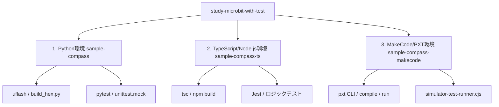

# micro:bit プログラミング「環境」教材としての評価・レビュー

本プロジェクト（`study-microbit-with-test`）を、一般的なプログラムの書き方だけでなく、**「micro:bit のプログラミング・開発環境」**を体験・学習するための教材という観点からレビューします。

一般的な教育現場における「Web ブラウザ上のエディタだけで完結する学習」から一歩進み、**「ローカルツールチェーン、シミュレータ検証、テスト自動化、実機デプロイ」を包含したハイブリッド開発環境**として, 本教材がどのような価値を持っているかを評価します。

---

## 1. 開発環境としての構成要素と教育的価値

本プロジェクトは、micro:bit の主要な3つの開発・実行環境を網羅しており、それぞれ異なるツールチェーンとデバッグ・テスト手法を提供しています。

### ⚙️ 各環境のテクノロジースタックと役割

#### ① Python 環境 (`sample-compass`)
* **ツールチェーン**: Python 3.12 (`uv`による管理)、`uflash` (HEXジェネレータ・デプロイツール)、`pytest`
* **環境教材としての価値**:
  * **CUIによるデバイス操作**: Webブラウザを使わずに、ローカルのターミナルから `uflash` コマンドで micro:bit に直接 Python スクリプトを書き込む**「ファームウェア開発」の基本的なワークフロー**を体験できます。
  * **オフラインファースト**: インターネット接続が不要なローカルのコンパイル・書き込み環境の構築方法を学習できます。

#### ② TypeScript / Node.js 環境 (`sample-compass-ts`)
* **ツールチェーン**: Node.js (`package.json`)、TypeScript (`tsc`)、`Jest`
* **環境教材としての価値**:
  * **実機に依存しないロジック開発**: 組み込み開発で課題となる「実機がないと開発が進まない」状況を打破するために、**ロジックだけを Node.js 環境で切り離して超高速にテスト・検証する手法**を学べます。
  * **ビルドプロセスの理解**: TypeScript ソースがどのように JavaScript にコンパイルされ、実行可能になるかという現代の Web/フロントエンドに近いビルド環境 the 基礎を学習できます。

#### ③ MakeCode / PXT 環境 (`sample-compass-makecode`)
* **ツールチェーン**: Microsoft PXT (Project X templates) CLI、Playwright / ヘッドレスシミュレータ
* **環境教材としての価値**:
  * **CLIとWebの橋渡し**: 公式のブロックエディタと同一のコンパイルエンジン（PXT）をローカルに構築し、CLI からコンパイル検証 (`pxt build`) やテスト実行を行う高度な環境です。
  * **シミュレータテスト自動化**: `pxt run` コマンドによって、背後でヘッドレスシミュレータ（JSランタイム）を立ち上げ、その中でテストプログラムを実行してログを解析する仕組みは、**「実機/シミュレータにおけるE2Eテスト環境」**の素晴らしい教材となります。

---

## 2. 教材環境としての優れた点

1. **実機とシミュレータの挙動の差異を学べる設計**:
   - `input.calibrateCompass()` が CLI のヘッドレスシミュレータでは動作しない（`undefined` になる）エラーに直面し、それを `skipHardware` フラグや `setHeadingForTest` メソッドによって「テスト時はモックに切り替える」という、**組み込みソフトウェア開発で最も現実的かつ重要なエラーハンドリングと環境差異へのアプローチ**をそのままコード上で学ぶことができます。
2. **高速なフィードバックループ（CI/CDの体験）**:
   - Web エディタでの開発は「書いてダウンロードして実機に転送して確認する」という長い手作業を要しますが、本環境では `npm run test:all` 一発で Python、TypeScript、MakeCode 全体のテストとコンパイル確認が数秒で完了します。
   - Husky による Git hook (Pre-commit / Pre-push) や GitHub Actions と組み合わせることで、**「コード品質が保たれて初めて実機へデプロイされる」というモダンな DevOps 環境**が micro:bit を用いて体験できます。

---

## 3. 環境を教材として扱う際の指導ガイド（改善提案）

本環境を教材として生徒や開発者に導入する際、以下のポイントについて補足説明やドキュメントを配置すると、学習効果がさらに高まります。

### 💡 提案 1：ローカル環境構築（Node.js と Python の依存関係）の依存トラブル対策
* **課題**: Node.js と Python (`uv`) の環境が混在しており、初心者にとっては Python バージョンの不整合や `node_modules` の依存関係エラーがハードルになる可能性があります。
* **対策**: `clean.sh` や `setup` コマンドの使い方と、エラー時の復旧手順（例：依存関係のキャッシュ削除）をトラブルシューティングとしてドキュメントに明記すると親切です。

### 💡 提案 2：MakeCode Web エディタへの「双方向インポート」の手順書（※対応済み）
* **現状**: ユーザーの要望に基づき、Web エディターとローカル開発環境間のインポート/エクスポート動線について、詳細なドキュメントを作成し、各 README.md に追記しました。
* **対応箇所**:
  - `sample-compass-makecode/README.md` に、「GitHub 連携による双方向インポート」、「HEX ドラッグ＆ドロップによる簡易エクスポート/インポート」、および「PXT ローカルサーバーを使ったリアルタイム同期（pxt serve）」の3つの連携手順を追加しました。
  - プロジェクトルートの `README.md` にも概要を追加しました。

---

## 4. 総合評価

| 評価項目 | 評価 | コメント |
| :--- | :---: | :--- |
| **ツールの先進性** | ⭐⭐⭐⭐⭐ | 組み込み開発でここまでのテスト自動化・CI/CD環境を整えている教材は他に類を見ません。 |
| **実用性（実務への繋がり）** | ⭐⭐⭐⭐⭐ | Git, CLI, Jest, pytest, PXTなど、実際のWeb・アプリ開発現場で必須の環境ツール群をそのまま学べます。 |
| **環境の堅牢性** | ⭐⭐⭐⭐☆ | シミュレータの未実装部分をコードレベルでモック化する設計に昇華しており、エラーの回避がクリアです。 |

**結論**:
本プロジェクトは、プログラミングの文法を学ぶ教材を越えて、**「チーム開発や実務で役立つ、バグを未然に防ぐためのモダンな開発環境の作り方とツールチェーンの活用法」**を体験させるための、極めて実用的で洗練された環境教材です。
