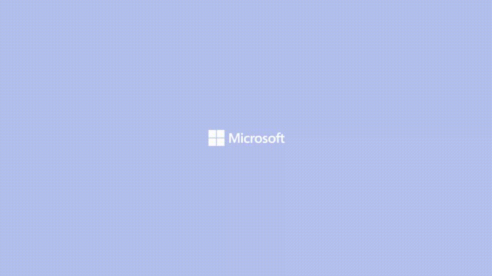
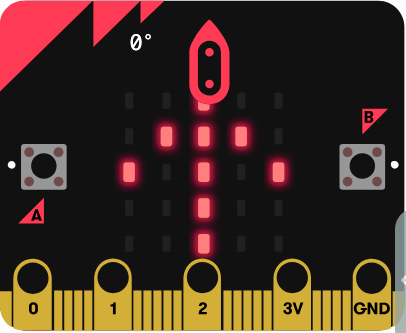
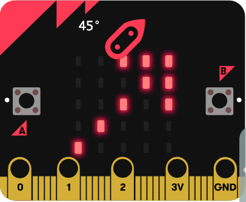
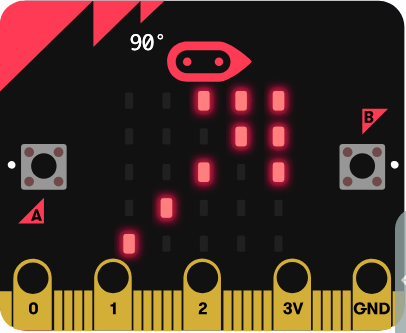
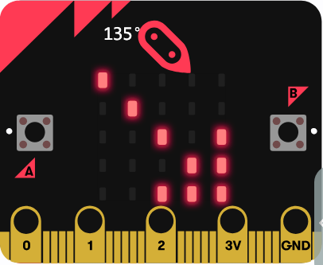
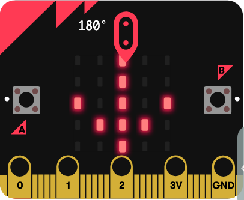

# sample-compass-makecode: MakeCode/PXT版

> **📚 参照**: プロジェクト全体については [`../README.md`](../README.md) をご覧ください。詳細な開発ガイドは本ディレクトリの `.vscode/CLAUDE.md` を参照。

MakeCodeのブロック、TypeScript、シミュレーター、実機HEXをつなぐ方位磁石教材です。

## 目次

- [概要](#概要)
- [動作](#動作)
- [操作デモ](#操作デモ)
  - [シミュレータ画面の実演動画](#シミュレータ画面の実演動画)
  - [ブラウザウィンドウを表示して実行](#ブラウザウィンドウを表示して実行)
  - [バックグラウンドで実行（ヘッドレスモード）](#バックグラウンドで実行ヘッドレスモード)
- [LED 表示パターン](#led-表示パターン)
  - [方向別 LED パターン](#方向別-led-パターン)
  - [実装での使用例](#実装での使用例)
- [セットアップとテスト](#セットアップとテスト)
- [テストカバレッジ](#テストカバレッジ)
  - [テスト結果](#テスト結果)
  - [テストカバレッジの特性](#テストカバレッジの特性)
  - [カバレッジの確認方法](#カバレッジの確認方法)
- [ビルド](#ビルド)
- [MakeCode Webとの相互利用](#makecode-webとの相互利用)
  - [HEXを使う（推奨）](#hexを使う推奨)
  - [GitHub連携の注意](#github連携の注意)
- [ブロックAPI](#ブロックapi)
- [ブロック変換を検証する](#ブロック変換を検証する)
- [ファイル](#ファイル)
- [学習課題](#学習課題)
- [ライセンス](#ライセンス)

---

## 概要

MakeCode Web のシミュレーター上で、コンパスプログラムの完全な動作を検証できます。
ブロック、TypeScript、実機 HEX を統合した教材です。

## 動作

- Aボタン: コンパス校正
- Bボタン: 方位と角度を表示
- forever: 現在の8方位をLED表示
- 未校正: `CAL`
- センサー異常: `ERR`

実機の方位角は `input.compassHeading()` から取得します。加速度APIは使用しません。

---

## 操作デモ

### シミュレータ画面の実演動画



上の GIF は、ブラウザで実際に動作するシミュレータをスクリーンキャストしたものです。

**デモで確認できる動作**:
- ✅ コンパスプログラムの実行
- ✅ 8 方位の自動判定
- ✅ LED マトリックスへの矢印表示
- ✅ ボタン操作によるキャリブレーション

### ブラウザウィンドウを表示して実行

```bash
PLAYWRIGHT_HEADLESS=0 npm run test:simulator
```

- ✅ ブラウザウィンドウが自動で開く
- ✅ MakeCode シミュレータの動作をリアルタイムで確認
- ✅ ボタン操作、LED 表示、キャリブレーション状態を検証
- ✅ 実行時間: 約 50 秒

### バックグラウンドで実行（ヘッドレスモード）

```bash
npm run test:simulator
```

- ✅ ブラウザウィンドウなし
- ✅ テスト結果をコンソール出力（35/35 成功）
- ✅ 実行時間: 約 50 秒（PXT シミュレーター含む）

**検証項目**:
| 検証項目 | 詳細 |
|---------|------|
| 📍 コード実行 | compass.ts をシミュレータで実行 |
| 📐 8方位判定 | 0°～315° の各方向を正確に判定 |
| 🔴 LED 表示 | 5×5 LED マトリックスに 8 方向の矢印を表示 |
| 🔧 キャリブレーション | ボタン A で校正開始、校正完了後に方向を表示 |
| ⚠️ エラーハンドリング | 負数、範囲外、NaN 値を `ERR` で表示 |

---

## LED 表示パターン

micro:bit の 5×5 LED マトリックスに、現在の方位を示す 8 方向の矢印を表示します。

### 方向別 LED パターン

各角度で表示される矢印（MakeCode シミュレーター実際のキャプチャ）:

| 角度 | 方向 | 矢印 | LED パターン（シミュレーター） |
|------|------|------|------|
| **0°** | **北（N）** | **↑** |  |
| **45°** | **北東（NE）** | **↗** |  |
| **90°** | **東（E）** | **→** |  |
| **135°** | **南東（SE）** | **↘** |  |
| **180°** | **南（S）** | **↓** |  |
| **225°** | **南西（SW）** | **↙** |  |
| **270°** | **西（W）** | **←** |  |
| **315°** | **北西（NW）** | **↖** |  |

### 実装での使用例

```typescript
// compass.ts の headingToDirection 関数で方位を判定
// その結果に応じて LED に矢印を表示
enum Direction {
  N = 'N',    // 北（↑）
  NE = 'NE',  // 北東（↗）
  E = 'E',    // 東（→）
  SE = 'SE',  // 南東（↘）
  S = 'S',    // 南（↓）
  SW = 'SW',  // 南西（↙）
  W = 'W',    // 西（←）
  NW = 'NW'   // 北西（↖）
}

// main.ts で使用
if (direction === 'N') {
  basic.showArrow(ArrowNames.NORTH);    // 北向き矢印を表示
} else if (direction === 'NE') {
  basic.showArrow(ArrowNames.NORTH_EAST);  // 北東向き矢印を表示
}
// ... 以下 8 方位まで
```

---

## セットアップとテスト

```bash
npm ci
npm test
```

`npm test` は次を順に実行します。

1. シミュレーターテスト結果パーサーのNodeテスト
2. `pxt test` によるコンパイル検査
3. PXTシミュレーターでの8方位、境界値、校正状態テスト

テストでは、ブロックに表示されない `Compass.calibrateForTest()` と `Compass.setHeadingForTest()` が実機センサーを置き換えます。PXT シミュレーターの成功は、実機の磁気センサー精度を保証しません。

## テストカバレッジ

### 📊 テスト結果: **35/35 成功** ✅

```
test:runner      (Node.js テスト)           4/4 成功
test:compile     (PXT コンパイル検査)        成功
test:simulator   (PXT シミュレーター)        35/35 成功

================================ テスト項目 ================================

8 方位判定テスト (24 テスト):
✓ 北（N）: 0°, 359°, 22.5°, 45°, 357°
✓ 北東（NE）: 22.5°, 45°, 67.5°
✓ 東（E）: 67.5°, 90°, 112°
✓ 南東（SE）: 112.5°, 135°, 157°
✓ 南（S）: 157.5°, 180°, 202°
✓ 南西（SW）: 202.5°, 225°, 247°
✓ 西（W）: 247.5°, 270°, 292°
✓ 北西（NW）: 292.5°, 315°, 337°

境界値テスト (4 テスト):
✓ 22.4° → N（22.5° 境界未満）
✓ 67.4° → NE（67.5° 境界未満）
✓ 202.4° → S（202.5° 境界未満）
✓ 337.4° → NW（337.5° 境界未満）

エラーハンドリング (3 テスト):
✓ -5° → ERR（負数）
✓ 400° → ERR（範囲外）
✓ NaN → ERR（特殊値）

キャリブレーション / 状態テスト (4 テスト):
✓ 初期状態: isCalibrated() == false
✓ 未校正時の getDirection() == CAL
✓ 校正後: isCalibrated() == true
✓ 校正後のデフォルト状態（heading = 0） == N

実行時間: 約 50 秒（PXT シミュレーター含む）
================================
```

### テストカバレッジの特性

MakeCode/PXT では従来のコードカバレッジ（行、分岐、関数）を測定しません。代わりに：

- **ブロック変換検証**: TypeScript がブロックへ正しく変換されるか確認
- **シミュレーター実行検証**: 変換後のブロックが PXT シミュレーター上で正常に動作するか確認
- **仕様カバレッジ**: 8 方位、境界値、エラー処理などの仕様要件をカバー

### カバレッジの確認方法

```bash
# テスト実行と結果確認
npm test

# 詳細なテストログを表示
npm run test:simulator

# 実行時間を確認
npm test 2>&1 | tail -20
```

## ビルド

```bash
npm run build
```

生成先は `built/binary.hex` です。USB接続したmicro:bitドライブへコピーし、実機で校正と表示を確認します。

ローカルMakeCodeエディター:

```bash
npm run serve
```

## MakeCode Webとの相互利用

### HEXを使う（推奨）

1. `npm run build` を実行
2. <https://makecode.microbit.org/> を開く
3. `built/binary.hex` を画面へドラッグ＆ドロップ

### GitHub連携の注意

このプロジェクトはモノレポのサブディレクトリにあり、リポジトリルートには `pxt.json` がありません。モノレポのGitHub URLをMakeCodeへ直接インポートすると、このPXTプロジェクトとして認識されません。

GitHub連携を使う場合は、`sample-compass-makecode` の内容を専用リポジトリのルートへ置き、そのリポジトリをMakeCodeからインポートしてください。ローカルとの確認だけならHEXまたは `npm run serve` が簡単です。

## ブロックAPI

`compass.ts` の `//% block` 注釈により、次の関数が「コンパス」カテゴリへ表示されます。

- コンパスをキャリブレーション
- コンパスの度数 (度)
- コンパスの方角
- コンパスはキャリブレーション済み
- 方位角 $heading 度の方角
- コンパス状態を表示

`calibrateForTest()` と `setHeadingForTest()` は自動テスト専用で、ブロックには公開しません。方位変換へ範囲外や `NaN` を渡した場合は、ブロック UI を停止させず `ERR` を返します。

## ブロック変換を検証する

ルートで実行します。

```bash
npm run verify:blocks
```

PlaywrightがMakeCode WebでTypeScriptをブロックへ切り替え、変換エラー、グレーブロック、ワークスペース欠落を検査します。ブロック表示対応HEXは `built/blocks.hex` に生成され、通常のPXTビルドが生成する `built/binary.hex` を上書きしません。ネットワーク接続が必要です。

## ファイル

- [`main.ts`](./src/main.ts) — ボタンイベントと表示ループ
- [`compass.ts`](./src/compass.ts) — 状態、実機API、8方位変換
- [`test.ts`](./test/test.ts) — PXTシミュレーター内テスト
- [`simulator-test-runner.cjs`](./simulator-test-runner.cjs) — シミュレーター起動と結果検査
- [`pxt.json`](./pxt.json) — MakeCodeプロジェクト定義

## 学習課題

- `337.4` と `337.5` の境界テストを比較する
- **16 方位**へ拡張し、11.25 度ごとのブロック条件を設計する
- 方位角の履歴から**移動平均**を計算し、LED 表示の揺れを減らす
- 加速度ブロックを組み合わせ、実機を傾けた場合の**傾き補正**を試す
- 実機を安全な金属へ近づけ、表示変化という**磁気干渉**を観察して記録する

## ライセンス

[MIT License](../LICENSE)
