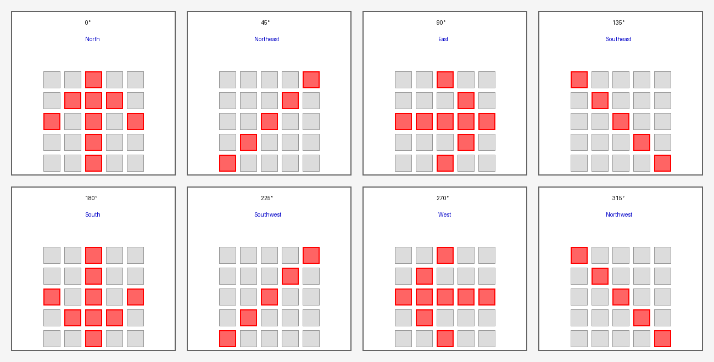
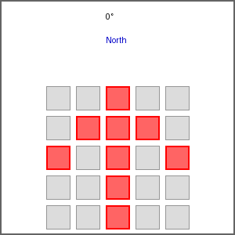
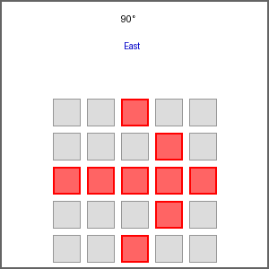
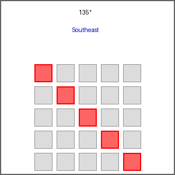
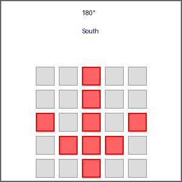
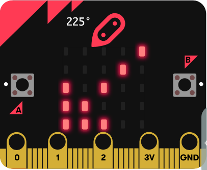
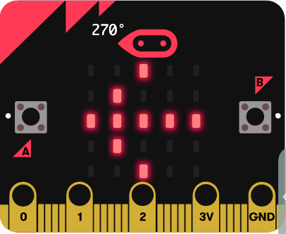
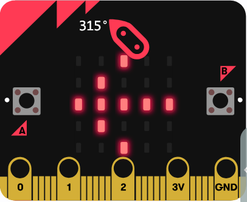

# sample-compass: Python版

[](https://github.com/katoy/study-microbit-with-test/actions/workflows/integration-tests.yml)

> **📚 参照**: プロジェクト全体については [`../README.md`](../README.md) を、開発ガイドについては [`CLAUDE.md`](./CLAUDE.md) を参照してください。

micro:bit方位磁石のPython教材です。MakeCodeのブロックへ変換できるStatic Pythonを扱っています。

## 概要

**目的**: Python 3.12.8 で MakeCode 互換の方位磁石アプリケーションを実装・テスト

**テスト戦略**:
1. **ユニットテスト** (`test_coverage.py`) - 方向判定ロジックの完全検証（カバレッジ 100%）
2. **シミュレーターテスト** (`test_simulator.py`) - MakeCode 環境での統合動作検証
3. **実機テスト** - 手動による micro:bit での動作確認

詳細は [`CLAUDE.md`](./CLAUDE.md) を参照。

## ファイル構成

| ファイル | 実行環境 | センサーAPI | ブロック変換 |
|---|---|---|---|
| [`compass_makecode.py`](./src/compass_makecode.py) | MakeCode Python | `input.compass_heading()` | 対応 |

## セットアップ

```bash
# プロジェクト依存関係のインストール
cd sample-compass
uv sync

# ブラウザ自動化ツールのセットアップ（初回のみ）
uv run playwright install chromium
```

## 操作デモ

### シミュレータ画面の実演動画


上の GIF はブラウザで実際に動作するシミュレータをスクリーンキャストしたものです。以下のコマンドを実行すると、同様の動画が自動的に記録・生成されます。

### 実際のシミュレータで確認

ブラウザウィンドウにシミュレータを表示しながら、テストを実行します：

```bash
# ブラウザウィンドウを表示してシミュレーターテストを実行
# テスト完了後、自動的に simulator-demo.gif が生成されます
PLAYWRIGHT_HEADLESS=0 uv run pytest test/test_simulator.py -v -s
```

または、ブラウザウィンドウを表示しない場合：

```bash
# ヘッドレスモード（バックグラウンド実行）
# テスト完了後、自動的に simulator-demo.gif が生成されます
uv run pytest test/test_simulator.py -v -s
```

#### ビデオ記録の制御

デフォルトではビデオは記録されません。ビデオを記録したい場合：

```bash
# ビデオを記録してテスト実行
RECORD_VIDEO=1 uv run pytest test/test_simulator.py -v -s
```

- `RECORD_VIDEO=0` (デフォルト): ビデオ記録を無効化（テスト実行時間が短い）
- `RECORD_VIDEO=1`: ビデオを記録し、GIF に変換（実演動画が生成される）

このテストは実際のブラウザで MakeCode シミュレータを起動し、以下の動作を確認します：

1. ✅ **コード実行**: compass_makecode.py をシミュレータで実行
2. ✅ **方向判定**: 0°～315° の各方向を正確に判定
3. ✅ **LED 表示**: 5×5 LED マトリックスに矢印パターンを表示
4. ✅ **キャリブレーション**: ボタン操作による校正機能
5. ✅ **動画記録**: テスト実行がスクリーンキャストとして GIF に自動保存（制御可能）

**実行時間**: 約 30～40 秒（インターネット接続が必要）

マウスドラッグでシミュレータの向きを回転させると、LED ディスプレイに **8 つの方向** が表示されます。

| 角度 | 方向 | LED パターン |
|------|------|----------|
| 0° | 北（N） | ↑ |
| 45° | 北東（NE） | ↗ |
| 90° | 東（E） | → |
| 135° | 南東（SE） | ↘ |
| 180° | 南（S） | ↓ |
| 225° | 南西（SW） | ↙ |
| 270° | 西（W） | ← |
| 315° | 北西（NW） | ↖ |

### キャリブレーション

初回起動時は「CAL」メッセージが表示されます。この状態で**ボタン A** を押すとキャリブレーションが開始されます。

## LED 表示パターン

各方向に対応する LED 表示パターンを以下に示します。方位磁石がキャリブレーションされ、シミュレーターで向きが回転すると、これらのパターンが 5×5 LED マトリックスに表示されます。

### 方向別 LED パターン一覧



### 個別パターン詳細

| 角度 | 方向 | LED パターン | スクリーンショット |
|------|------|----------|-------------|
| 0° | 北（N） | ↑ |  |
| 45° | 北東（NE） | ↗ |  |
| 90° | 東（E） | → |  |
| 135° | 南東（SE） | ↘ |  |
| 180° | 南（S） | ↓ |  |
| 225° | 南西（SW） | ↙ |  |
| 270° | 西（W） | ← |  |
| 315° | 北西（NW） | ↖ |  |

**表示について:**
- 🔴 **赤色 LED**: 点灯している LED
- ⚪ **灰色 LED**: 消灯している LED

## よく使うコマンド

| コマンド | 説明 |
|---|---|
| `uv run ruff check src/compass_makecode.py test/test_coverage.py` | Lint チェック (Ruff) |
| `npm run lint:python` | Python Lint チェック |
| `uv run pytest test/ -v` | 全テスト実行（ユニット + シミュレーター） |
| `uv run pytest test/test_coverage.py -v` | ユニットテストのみ |
| `uv run pytest test/test_simulator.py -v` | シミュレーターテストのみ |
| `uv run pytest test/ -v --cov=compass_makecode --cov-report=html` | カバレッジレポート生成 |

## テスト実行

### 全テスト（推奨）
```bash
uv run pytest test/ -v --cov=compass_makecode --cov-report=term-missing
```
- **ユニットテスト** (43 テスト): 方向判定ロジックの境界値テスト
- **シミュレーターテスト** (1 テスト): MakeCode Web 上での統合検証
- **カバレッジ**: 100% 保証

期待される結果:
```
================================ tests coverage ================================
Name                      Stmts   Miss  Cover   Missing
---------------------------------------------------------------------------
src/compass_makecode.py      62      0   100%
---------------------------------------------------------------------------
============================== 44 passed in 33.50s ==============================
```

### ユニットテスト（高速、開発用）
```bash
uv run pytest test/test_coverage.py -v
```
- 8 方位 (N, NE, E, SE, S, SW, W, NW) の境界値検証（30 テスト）
- エラーハンドリング検証（負数、NaN、範囲外）
- キャリブレーション / ボタン / ループ関数の動作検証（13 テスト）
- 実行時間: 0.1 秒

### シミュレーターテスト（完全検証）
```bash
uv run pytest test/test_simulator.py -v
```
- Playwright で MakeCode Web シミュレーター上での動作を検証
- 45度ずつ (0°, 45°, 90°, ..., 315°) の回転と LED 表示パターンを確認
- Pre-push hook と CI パイプラインで実行
- 実行時間: 30+ 秒（ネットワーク依存）

### カバレッジレポート（HTML）
```bash
uv run pytest test/ -v --cov=compass_makecode --cov-report=html
open htmlcov/index.html
```
- 詳細なカバレッジレポートをブラウザで表示
- 各行の実行状況を視覚的に確認

### 構文チェック（最高速）
```bash
uv run python -m py_compile src/compass_makecode.py
```
- Pre-commit hook で自動実行
- MakeCode への変換前のバリデーション
- 実行時間: < 0.1 秒

## MakeCode で実行する

1. <https://makecode.microbit.org/> で新規プロジェクト作成
2. Python へ切り替え
3. [`src/compass_makecode.py`](./src/compass_makecode.py) の内容をコピーペースト
4. ブロックへ切り替えて変換を確認
5. シミュレーター（または実機）で動作確認

## CI/CD 統合

### GitHub Actions
`.github/workflows/integration-tests.yml` で自動実行：
- Python 3.12.8 環境をセットアップ
- `uv sync` で依存関係をインストール
- 全テスト (`test/`) 実行＋カバレッジ検証 (100% 必須)
- すべて成功してから CI の他の実装テストへ

### ローカルテスト
```bash
# ルートディレクトリから
npm run test:python     # Python テストのみ（ユニット + シミュレーター）
npm run test:all        # すべての実装をテスト
```

## テストカバレッジ詳細

### 📊 カバレッジ結果: 100% ✅

```
================================ tests coverage ================================
Name                      Stmts   Miss  Cover   Missing
---------------------------------------------------------------------------
src/compass_makecode.py      62      0   100%
---------------------------------------------------------------------------
TOTAL                        62      0   100%
============================== 44 passed in 32.55s ==============================
```

**達成状況**:
- ✅ **すべての関数をカバー**: `calibrate_compass()`, `get_direction_string()`, `on_button_pressed_a()`, `on_forever()`
- ✅ **すべての条件分岐をカバー**: 8 方位の判定ロジック、エラーハンドリング、校正状態
- ✅ **すべての実行パスをカバー**: 44 テストケース（43 ユニット + 1 シミュレーター）

### 100% カバレッジの達成方法

**ユニットテスト** (`test/test_coverage.py`, 43 テスト):

1. **方向判定ロジック** (30 テスト)
   - 8 方位の判定関数 `get_direction_string(heading: float) -> str`
   - 各方位の境界値テスト:
     - NORTH: 0°, 359°, 22.4° (< 22.5), 337.5° (≥)
     - NORTHEAST: 22.5°, 45°, 67.4° (< 67.5), 67.5° (≥)
     - EAST, SOUTHEAST, SOUTH, SOUTHWEST, WEST, NORTHWEST（同様）
   - エラーハンドリング:
     - 負数: -1
     - 範囲外: 360°, 720°
     - 特殊値: NaN (float("nan"))

2. **関数テスト** (13 テスト)
   - `calibrate_compass()`: グローバル状態変更、LED表示、キャリブレーション実行
   - `on_button_pressed_a()` (2 テスト):
     - 校正未完了時: キャリブレーション処理の実行
     - 校正完了時: 方位角と方向の console.log 出力
   - `on_forever()` (10 テスト):
     - 校正未完了時: "CAL" メッセージ表示
     - 校正完了時（全 8 方位 + エラー）:
       - N (0°), E (90°), S (180°), W (270°): 矢印表示
       - NE (45°), SE (135°), SW (225°), NW (315°): 矢印表示
       - 負数エラー: "ERR" メッセージ表示

**シミュレーターテスト** (`test/test_simulator.py`, 1 テスト):
- MakeCode Web 上での統合検証
- ブロック変換後の動作確認
- 45° ステップでの回転テストと LED パターン検証

### 計測方法

```bash
# デフォルト計測（コンソール出力）
uv run pytest test/ -v --cov=compass_makecode --cov-report=term-missing

# HTML レポート生成
uv run pytest test/ -v --cov=compass_makecode --cov-report=html
open htmlcov/index.html

# JSON レポート（CI 統合用）
uv run pytest test/ --cov=compass_makecode --cov-report=json
```

### CI での検証

`.github/workflows/integration-tests.yml` で自動実行：

```yaml
# Python Playwright シミュレーターテスト
- name: Run Python tests
  working-directory: ./projects/sample-compass
  run: |
    uv sync
    uv run playwright install
    uv run python -m pytest test/ -v --cov=compass_makecode --cov-report=term-missing
```

**カバレッジが 100% 未満の場合は CI が失敗**します（必須チェック）。

### カバレッジが 100% 未満になった場合

```bash
# 未カバーの行を確認
uv run pytest test/ -v --cov=compass_makecode --cov-report=term-missing

# 詳細な HTML レポート確認
uv run pytest test/ -v --cov=compass_makecode --cov-report=html
open htmlcov/index.html

# 特定のテストのみ実行して確認
uv run pytest test/test_coverage.py::TestGetDirectionString -v
```

## トラブルシューティング

### `uv sync` が失敗する
```bash
rm -rf .venv
uv sync
```

### Playwright インストール失敗
```bash
uv run playwright install chromium
```

### テストがタイムアウトする
- ネットワーク遅延の可能性
- `pytest test/test_simulator.py -v --timeout=30` で制限時間を設定

### シミュレーターに接続できない
- MakeCode Web のサーバーが一時的に不安定な可能性
- しばらく待ってから再実行

### カバレッジが 100% 未満
```bash
# 未カバーの行を確認
uv run pytest test/ -v --cov=compass_makecode --cov-report=term-missing

# HTML レポートで詳細確認
uv run pytest test/ -v --cov=compass_makecode --cov-report=html
open htmlcov/index.html
```

## ドキュメント

- [`CLAUDE.md`](./CLAUDE.md) - AI アシスタント向けの詳細ガイド（テスト戦略・デバッグ方法）
- [`../compass_spec.md`](../compass_spec.md) - 共通アプリケーション仕様
- [`../CLAUDE.md`](../CLAUDE.md) - プロジェクト全体のガイド
- [`../HEX_BUILD_GUIDE.md`](../HEX_BUILD_GUIDE.md) - HEX ファイル生成手順

## 学習課題

- **16 方位** へ拡張し、11.25 度の境界テストを設計する
- シミュレーターテストに **追加のテストケース** を設計する
- **エラーハンドリング** を改善する（磁気センサーが利用不可な場合など）
- 複数回の方位角から**移動平均**を求め、359 度と 1 度の扱いを工夫する
- 加速度センサーを組み合わせた**傾き補正**の入力を設計する
- 実機を安全な金属へ近づけ、方位角の揺れという**磁気干渉**を記録する

## ライセンス

[MIT License](../LICENSE)
